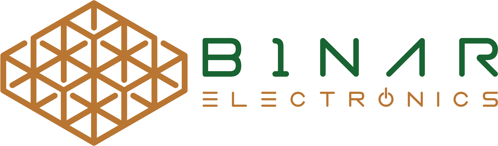

# Binar Electronics Prototype Landing Page



**Note: This is a prototype of the Binar Electronics landing page. For the most current and actively developed version of our website, please visit our [active development repository](https://github.com/binarelectronics/binarelectronics.ro-under-construction).**

Welcome to the official repository of the Binar Electronics "Coming Soon!" website prototype. This prototype showcases our PCB and Embedded Software services, providing information about who we are, what we do, and how to contact us. Whether you are an electronics enthusiast or a potential client, this repository is a sneak peek into our world of innovative electronic product development.

## Table of Contents

- [Overview](#overview)
- [Getting Started](#getting-started)
- [Description](#description)
- [Services](#services)
- [Contact Information](#contact-information)

## Overview

We are Binar Electronics, and we specialize in helping customers tackle PCB and Embedded Software challenges to create innovative electronic products through outsourcing in Romania. With over 12 years of experience in electronic design and 17 years in software development, we assist companies in their product development, continually evolving with each project and implementing efficient strategies.

## Getting Started

To view our "Coming Soon!" website prototype, you can follow these simple steps:

1. Clone this repository to your local machine.

   ```bash
   git clone https://github.com/not-sample-text/binarelectronics-landing
   ```

2. Open the `index.html` file in your web browser.

Now you can explore our prototype website and learn more about our services!

## Description

The prototype website is a simple and elegant introduction to Binar Electronics. Here are some key features:

- **Logo**: Our distinctive logo is prominently displayed on the website, representing our brand.

- **Description**: A brief but informative description of our company and our core values.

- **Services**: We offer a variety of services, each with its own unique icon and description. You can learn more about our PCB services, Embedded Software expertise, and more.

- **Footer**: The footer contains our contact information, including phone number, email, and physical address. You'll also find a QR code for easy access to our contact details.

## Services

We offer a range of services in the field of electronics:

- **PCB Prototyping**: Rapidly turn your ideas into prototypes.

- **PCB Consultancy**: Expert advice to guide your project.

- **PCB Design**: Create customized circuit board designs.

- **PCB Production**: Mass production of high-quality PCBs.

- **PCB Assembly**: Assemble and test PCBs.

- **BOM Consolidation**: Manage your Bill of Materials efficiently.

- **HW & SW Reverse Engineering**: Analyze and improve existing hardware and software.

- **Embedded Software**: Develop software for embedded systems.

## Contact Information

You can reach us via:

- **Phone**: +40 766 220 126

- **Email**: [contact@binarelectronics.ro](mailto:contact@binarelectronics.ro)

- **Address**: Argesului no. 14, Baia Mare, Romania

Feel free to [visit our website](https://binarelectronics.ro) to learn more about our services and stay up-to-date with our latest developments.

Thank you for visiting our prototype repository! We look forward to helping you with your electronics projects in the future. For the latest updates, please check our [active development repository](https://github.com/binarelectronics/binarelectronics.ro-under-construction).
